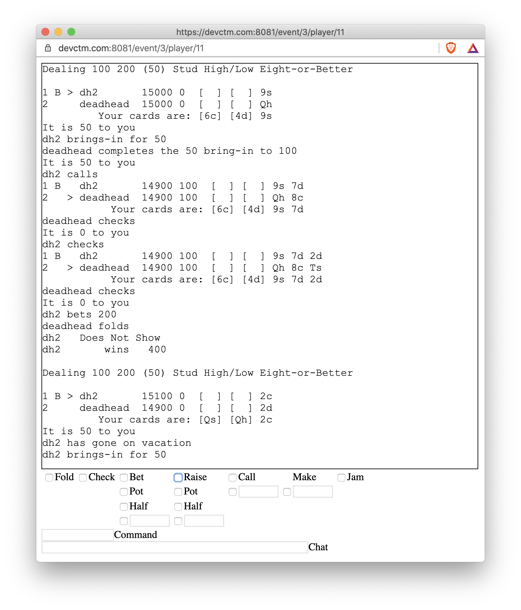

# Mb2

Mb2 is Cliff Matthews's poker software.

If you don't like reading, you can go to
[https://devctm.com](https://devctm.com "Pre-alpha")
and start playing now.

There's an unfinished [Players'
Manual](https://ctm.github.io/docs/players_manual/) that _probably_
has better and more current info than this README, but if you're
bored, read both.

Feel free to create a tournament using the plus sign in the lobby,
then join it, create another account, have the second account join the
tournament also and ... wait for the tournament to start.  Yes, that's
cumbersome, so I'll create a one-button demo, but not just yet.

Eventually mb2 will have slick, skinnable interface, but it's being
developed from the inside out, so although it has excellent game
mechanics, its UI is currently amazingly bad

All of the advanced action possibilities are exposed through
a rudimentary set of check-boxes and input fields.  Discarding can be
done by clicking on cards and then clicking on a button.  Some lesser
used functionality still requires typing, but that is changing.

### Closed source

Mb2 is closed source, because it's hard to put toothpaste back in the
tube.  I'm monetizing mb2 and exploring closed source solutions first.
There are ways in which I can still make money and make the source
open, but it's trivial to go from closed to open and impossible to do
the reverse.

### Public documentation

This repository exists primarily as a place for me to publicly [track
issues](https://github.com/ctm/mb2-doc/issues) as more people use
mb2.  Secondarily, it contains this "documentation" (which may be out
of date).

## Web-only (using pop-ups)

Mb2 is accessed via a web interface.  Although the initial interface
was text-only, I've slowly added UI elements.  However, I'm not a
visual person, so I'm making no attempt to do graphic design.  That
will be done by professional front-end designers as part of a
Kickstarter (or something similar) campaign to be launched after BARGE
2020.

## Browser considerations

Mb2 uses many modern web technologies, especially WebAssembly and
WebSockets.  As such, you need a relatively recent browser, especially
if you want to use a Microsoft browser.  Specifically, no versions of
Internet Explorer work, and Edge must be version 79 or later (that's
when Microsoft switched to a Chromium base).  You can download the
latest Microsoft Edge at https://www.microsoft.com/en-us/edge

Here's what one mb2 users reported regarding Microsoft Edge:

> Microsoft Edge trivia: I had to separately request a download for
the Chromium-based Edge regardless of the release level or release
cycle the VM was running

Any relatively recent Safari or Chrome work well although you have to
jump through hoops to get audio on Safari.

On Safari, if you want to hear when it's your turn, you'll need to set
the "Auto-Play" setting for devctm.com to be "Allow All Auto-Play".
[This
article](https://www.howtogeek.com/326532/safari-now-disables-auto-playing-videos.-heres-how-to-allow-them-for-certain-sites/)
explains how to do it, although the article's title unhelpfully
implies that it's only for video.  If anyone knows of a better site
that explains how to enable audio (and doesn't mention video, even
though it's the exact same setting), please let me know. I want people
to be able to hear in Safari.  There's got to be a better explanation
out there somewhere.

### Pop-ups used for tables

When you first log in, you're in the lobby, a place where
people can join and set up tournaments.  Currently all tournaments are
started by time.  When a tournament is created it has a "start at"
attribute that specifies when the tournament will start.  Sit-n-gos
(and ring games) will be added, but there are higher priority issues
to complete first.

When a tournament starts, all players registered for that tournament
get a pop-up window for the table that they're assigned to, unless
their browser blocks pop-ups.  If the browser blocks the table pop-up,
a dialog will appear that tells you what happened and allows you to
click on an "OK" button create your table.

Using a pop-up for the table allows people to be on multiple tables at
once.  So it's slightly more convenient if you set your browser to
allow https://devctm.com to create pop-ups, but it's not
necessary; allowing pop-ups just skips the need to click on an "OK"
button when a tournament starts.

### Shareable links

When you're playing on a table, the url that is displayed
(e.g. `https://devctm.com/event/78/player/10`) is shareable.
Anyone who follows that link is then connected to the server with an
anonymous read-only view of the table you're playing on. If you get
transferred to another table, your observers will be transferred
too.

Currently this feature is mostly a curiosity.  You probably only want
to share your url with someone who is prepared to see the incredibly
rough interface.  However, as the interface improves, the shared
experience improves.

### Usernames

Currently, you create a username simply by filling in a desired
username and a password.  If that username is available, the password
is remembered in the database and nobody else can use that username
with a different password.  If you try to use a username that already
has a password assigned to it, you'll not be able to log in and be
told that you supplied an invalid password.

Before a username is placed in the database, it is canonicalized by
removing all characters that aren't alphanumeric and translating the
alphabetic characters to lower-case.  However, whatever you type when
you log in is what the other players see, so although you can't change
the canonical form of your username, you can mix it up by changing
which characters are upper-case and which are lower.  You can also add
white-space and emojis, although [emojis interfere with the primitive
character alignment](https://github.com/ctm/mb2-doc/issues/104) that's
currently used, so don't use emojis yet.

So, for example, if you create an account by typing `TestUser` in the
Username box, after you log out (by closing your lobby window/tab) you
can then log in with `testuser` or `TEST user` or even `Test User 😎`.
For the record, although this is a deliberate feature, I can't
guarantee that we'll keep it.  It may wind up being too confusing
and/or annoying.

### Player Ids

When you share a url, people can see your player id.  However, be
aware that devctm.com is a staging server and the player id that you
use on devctm.com will not necessarily be the player id you'll get on
the production site. However, player ids 1 through 9 are an exception.
I have already handed them out to some of the people who have greatly
increased the chance of me having written this server, even though
their influence has mostly been indirect.

I will reward early play-testers with low player ids on craftpoker.com
when it goes live.  On https://devctm.com player ids are handed
out sequentially, but the database is recording enough information for
for me to know who is testing and who isn't.  I'll use that, and other,
info to hand out ids 90-99 on craftpoker.com.  If that sounds confusing,
just ask me about it and I'll do a better job explaining.  My nickname
is `deadhead`.

### Fun Money only partially implemented

Since mid April, mb2 has internally been keeping track of Fun Money
that is used for tournament buy-ins and payouts. Although the core of
this functionality is implemented and deployed, there's currently
almost no exposure through the UI.

When [ring games are
implemented](https://github.com/ctm/mb2-doc/issues/88), Fun Money will
be documented and exposed and everyone's bankrolls will be reset.

## Lobby

After you sign in, you'll be in the lobby, where you can see which
tables have players on them and what upcoming tournaments are available
to join.  There's also a small white plus that you can click on to create
your own tournament.


The first line in the lobby is the nickname you've logged in as.  You may
have more than one nickname, but please don't use multiple nicknames to
mislead, collude or dump chips.

The second line lists the others logged in.

If any tables are active, each gets a row with the table id and a list
of the players at that table.  The table id itself is a link.  If you
click on it, you'll get a pop-up that allows you to observe that table.

Any upcoming tournaments that you're allowed to join are then
listed. To join, click the check-box.  If you change your mind, before
the tournament starts, just click the check-box again.

When you join a tournament there may be esoteric options that you can
choose via a pull-down in the right most column.  They should be
self-explanatory.  Above that column is the little white plus sign
that brings up the tournament creation modal dialog (see below).

The column labeled `#` is the number of players currently signed up.  If
you want to see which players are signed up, bring your cursor over that
number and the entrants' nicknames will be revealed.

The starting time is in the timezone that your browser is configured
to display.  That's normally the timezone you're in, but check the
three letter timezone abbreviation to be sure.

A synopsis of the tournament structure is in the `Tournament` column.
If you bring your cursor over the synopsis, more details will drop
down.

The rest of the lobby is chat and a box for you to enter chat.  All
chat is logged, however, currently only chat that occurs after you
sign in will be displayed.  That's pretty poor behavior and will be
improved.


### Creation of a new tournament

If you click on the white plus small icon, you get the following dialog:


The Structure attribute is a pull-down menu from one of approximately
50 pre-existing tournament structures.  Currently you can not create your
own structure, although traditionally the winner of the 5pm Pacific tournament
gets to pick the following day's tournaments and may request a new
structure.

Tournaments that are created for testing or demo purposes should be
Free, since free tournaments don't affect anyone's standings.
Tournaments where people are expected to play well should probably
have a 100 buy-in if for no other reason than to make it clear that
the participants will be taking the tournament seriously.

Adding a comment is optional.  If you add a comment, it will show up
when people hover over the tournament structure in the listing of
upcoming tournaments.

Start At is in the same timezone as upcoming tournaments are displayed in.
That's whatever your browser thinks your timezone is.  The first time
you bring up the "Add a Tournament" dialog, "Start At" is pre-populated
with a value that is ten minutes into the future.  However, after that,
the dialog simply remembers whatever value was in that field previously.

Round Duration (Minutes) is in essence a scaling factor.  In most
tournaments, all rounds are the same length.  When create a new tournament
and specify the round duration, what you're _really_ doing is saying how
long you want the first round to be.  If any rounds have a different duration
from the duration of the first round, they'll be scaled.

So, if there's a structure where the odd numbered rounds are 20 minutes
and the even numbered rounds are 30 minutes, if you specify Round
Duration as 5 minutes, then you'll have a tournament where the odd
numbered rounds are 5 minutes and the even ones are 7.5 minutes.

The TOC (Tournament of Champions) style format has a 15 minute Hold'em
first round, an 18 minute Stud second round and a 22 minute Omaha/8
third round.  So, if "Round Duration (Minutes)" is set to 5, then the
second round will be 6 minutes and the third round will be seven
minutes, twenty seconds long.

For a dozen or so players, five minute rounds for most structures results
in a tournament that finishes in about an hour and a half.

Seconds to Act is how much time a player gets to act before being sent
to vacation.  No, 999 is not a reasonable number of "Seconds to Act".
Typically we use 45 there and that's the default when this dialog comes
up.

A player may call time to get more time to act.  There currently is no
limit on how many times a player can call time.  Calling time resets
the number of seconds to act (it does _not_ add to the number of
seconds to act).  So, if "Seconds to Act after calling Time" is set to
60, calling time will mean that the player must act within 60 seconds
regardless of how much time to act the player had remaining.

Schedules have breaks built into them, and like Round Duration, they
scale based on the same ration of the "Round Duration (Minutes)"
setting to the duration of the first level in the structure.  That can
result in breaks that would be too short were it not for the "Minimum
Break Duration in Minutes" setting.  However, the duration of a break
is like the duration of a round in that it can start in the middle of
a hand. The players who are still in the hand still need to finish the
hand.

## Knows many poker variants

Mb2 can deal close analogs to almost all the [BARGE 2019
tournaments](https://irp-cdn.multiscreensite.com/7fa840da/files/uploaded/2019_BARGE_structures%20v2.pdf)
as well as the [EMBARGO 2020
tournaments](https://www.barge.org/schedule1).

Albeit with a few nits, mb2 already knows how to deal all the games in
the [BARGE Rule Book](http://www.ceemeck.org/BARGERuleBook2021/).

A couple of the games that are available have missing functionality
(e.g., mb2 doesn't yet enforce the "sevens rule" in California
Lowball). Known deficiencies show up on the [issues
page](https://github.com/ctm/mb2-doc/issues).


## Pre-built Tournament Structures

All of the [EMBARGO 2020 tournament structures](https://irp-cdn.multiscreensite.com/7fa840da/files/uploaded/2020%20EMBARGO%20Structures.pdf) and all but three of the
[BARGE 2019 tournament structures](https://irp-cdn.multiscreensite.com/7fa840da/files/uploaded/2019_BARGE_structures%20v2.pdf) are implemented.  The three that
aren't require some additional functionality.

It is not currently possible to directly inspect (much less edit) the
composition of the mixes that are used in tournament structures.  The
synopsis should present that information.

## Lammers

Some of the tournament structures (typically limited to big-bet)
include lammers in addition to starting chips.  Each lammer is worth a
fixed amount and can be used in four different ways:

### Redemption Before the First Hand

If you want to redeem any of your lammers before the first hand, you
must use the "extra options" menu from the lobby that's the rightmost
column in the upcoming tournaments area.  The leftmost column is the
check-box that you use to join.  The rightmost column is a down
chevron that has a drop-down menu associated with it.  When a
tournament uses lammers, that drop-down allows you to specify how many
of the lammers you want to redeem before the start of the first hand.

### Manual Redemption During The Game

The redeem command (requires use of the command text box) takes a
single numeric argument that specifies how many lammers you wish to
redeem (e.g., `redeem 2`).

If you are in a hand, the redemption will happen at the end of that
hand.  If you have a redemption scheduled for the end of the hand and
you change your mind you can use `redeem 0`.

If you're not in a hand, the redemption will happen immediately and can
not be reverted.

### Resurrection

If you bust and you have one or more lammers left, exactly one lammer
will be cashed in and you'll be back in the game with the amount of
chips that lammer is worth.

### Forced Redemption

Typically there's a final level where lammers are allowed and if you
finish that level, all lammers you have are redeemed for you (and all
your opponents) automatically.

## Table





### In Game Commands

I will be adding UI elements for everything mentioned here, but until
those UI elements appear, you have to type some esoteric commands in
the command box.

When you're in a game, the long versions (there are one letter
abbreviations for all of the common ones) of the commands that are not
available via UI elements are:

```
quit
vacation
time

muck
reveal
conceal
default reveal
default conceal
undo reveal

rebuy
rebuy_on_bust
done_on_bust
add_on

redeem n_lammers_to_redeem
```
These commands can also be typed in, although there are proof-of-concept UI elements that provide the same functionality:

```
status
back
cards
discard cards
discard none
undo action
undo discard
fold
check
jam
make amount
call [amount]
bet [amount | pot | half]
raise [amount | pot | half]
```

#### Fold

If you you check the `Fold` check-box, when it's your turn to act, you
will fold, even if it's checked toy you.

#### Check

If you check the `Check` check-box, when it's your turn to act, you will
check if there's no action to you. If there is action, you will have to
choose a different option.

#### Call

If you check the `Call` check-box at the top of the `Call` column, you will
call _any_ action to you, whether it's a bet, raise, re-raise, etc.

If you put a number inside the text-box at the bottom of the `Call` column,
you will call any action up to and including that number of chips.  If the
action to you is more than that number, you will fold.

#### Bet

Betting is the initiation of action, all four options in the `Bet` column
behave the same way in that when it's your turn to act, if there's already
a bet to you, none of the `Bet` options will be exercised, instead you'll
have to choose a different option.  This can be handy if you want to make
a bet, but only if you're first to act.

The other way in which all four options are similar is that what you are
specifying is the maximum you'd like to bet, but if there's a restriction
that prevents you from betting that much, you'll bet the maximum you're
allowed to bet.  The two restrictions are your chip count and whatever
type of limit you're using (e.g., pot-limit).  If, for example, you
click on the `Pot` check-box, and there's 600 in the pot, but you only have
500, if it gets to you and there's no bet, you will bet 500 and go all-in.

The distinction between between the four entries in the `Bet` column is
the top-most one will try to have you bet the minimum.  The one below
that that, labeled `Pot` will try to have you bet the amount currently
in the pot.  `Half` will try half the pot amount.  If you place a number
in the text-box at the bottom of the `Bet` column, you will try to bet
that amount, subject to the caveat in the previous paragraph.

#### Raise

Raise behaves almost like Bet. The big distinction is that Raise will take
effect _whether or not_ you have action to you.  So if you click the top-most
check-box in the `Raise` column, when it's your turn to act, you will either
bet the minimum if there's no action to you, or raise the minimum if there
is already a bet, raise or re-raise to you.

#### Make

If you use `raise 2000` as an advanced action, you will bet or raise
2000 (if that's an acceptable raise) when it is your turn to ask, so
if it's checked to you, you'll make it 2000, but if someone bets 1,000
and then someone else raises 2,000, then you'll raise 2,000 and the
total bet will be 5,000.  If your desire is to raise however much is
required to make the total bet 2,000, you can uses `make 2000`.

Just like Bet and Raise, if you try to make the action a value that is
higher than you're allowed to bet or raise, you'll bet the maximum
you're allowed to bet or raise.  So, if there's 500 in the pot and
you're playing pot-limit and you choose "make 2000", you will bet 500
(assuming you have 500 or more in chips), since that's the max you're
allowed to bet.

One aspect of `Make` that is not necessarily obvious is that you can
use it to call a particular amount but be given time to make a
decision if the action increases beyond that particular amount.  E.g.,
if the blinds are 100, 200 and you're on the button and you have a
hand that you definitely will play for free but you may want to fold
(or raise!)  if it's raised by the time the action gets to you can
choose to "make it 200" and then if the bet is raised, your make of
200 won't be considered action when it is your turn to act and you can
then decide whether to fold, call or raise.


#### Jam

Jam simply tries to bet the maximum you're allowed to bet.  In a
no-limit game, you get all your chips in.  In a pot-limit game, you
get as many as your chips are in, but limited by the size of the pot,
etc.

### Commands that currently require use of the command box


Use `time` (or its abbreviation `t`) if you need more time to think.
You'll get an extra minute.  There is currently no limit to how often
you can use the time command.

#### What to reveal at showdown

By default, you will only show your cards at the showdown if you have
to.  If there are no all-ins and someone else shows first and you're
beat, you won't be required to show your cards.  You can change that
default by using `default reveal` in which case any time you make it
to the showdown you'll reveal your cards (which might be helpful if
you're teaching someone the game).  If you want your default to be
back to what it started at `default conceal` will take it back.

You can override your default revelation strategy for the current
hand, by using `reveal` or `conceal`.  That's a one-time change
and after the showdown your default will stay what it was before that
override.  You can also use `muck` which will cause you to throw
away your hand, _even if it's a winner_.

#### Discards, drawing and undoing

If you're playing a game that includes discarding or drawing, you can
click on the cards you want to get rid of and then click on a "Discard"
button. If you do that before it's your turn to discard, you can change
your mind by doing more clicking.  When you have an advanced discard
request in place and it's still not your turn to discard, there will be
an "undo" button that you can use.

If none of your cards are selected (they pop up as you select them),
then instead of a "Discard" button, you'll have a "Stand Pat" button.

The above textual description may make it sound complicated, but in
practice it's pretty simple.

#### Rebuy Tournaments

If a tournament is a rebuy tournament, mb2 will assume you want to rebuy
each time you bust. If that's not the case, use the `done_on_bust` command
when you want your next bust to be permanent.  If you change your mind, you
can use `rebuy_on_bust` to tell the tournament that when you bust you want
to rebuy, but you must do that before you bust.

When you are playing in a rebuy tournament you can use the `rebuy`
command to ask for chips during the rebuy period.  If you are below
the starting stack size and out of the hand, you'll get them
immediately. If you're in the hand, your request will be remembered at
the end of the hand and if you're below the starting stack size,
you'll get your additional chips before the next hand is dealt.

If the rebuy tournament offers an add-on, you may use the `add_on` command
to claim your add-on during the appropriate break.

## Abbreviations

Instead of typing the entire command, you can usually abbreviate:

|Abbreviation|Command|
|------------|-------|
|b|back|
|c|call|
|d|discard|
|f|fold|
|h|help|
|j|jam|
|k|check|
|m|make|
|r|raise|
|s|status|
|t|time|
|v|vacation|
|q|quit|
|ca|cards|
|ck|check|
|de|default|
|hi|conceal|
|mu|muck|
|rb|rebuy|
|re|reveal|
|rob|rebuy_on_bust|
|dob|done_on_bust|
|add|add_on|
|pat|discard none|
|pot|raise pot|
|half|raise half|

## Play-testing

There's a 5pm Pacific time every day. Currently we have about a dozen
core players, but new people drop in almost every day and this site is
still _largely_ flying under the radar.

If you're curious, show up a ten or fifteen minutes before the start
of the game (5pm Pacific is 6pm Mountain, 7pm Central and 8pm
Eastern).  Someone will help you out. Once you know your way around
the software, please help out others.  I expect exponential growth,
"soon".

There may also be an 8pm Pacific tournament running.

Please consider scheduling your own tournaments and inviting people
who would otherwise be unfamiliar with this site.  Some of mb2's
current behavior is downright anti-social, including the fact that if
your WebSocket connection drops you have to log back in again and when
you do, your chat history is gone.  That prevents people from hanging
out in the lobby for any extended period, but that too will be fixed
"soon".

I can't promise anything, but anyone who schedules tournaments is
likely to be a strong influence on which features I implement next and
which bugs are the highest priority.


## Computer Languages, Frameworks and Libraries

I've written mb2 almost entirely in
[Rust](https://www.rust-lang.org/), using
[actix-web](https://actix.rs/), [yew](https://yew.rs/docs/),
[diesel](http://diesel.rs) and
[rust-argon2](https://github.com/sru-systems/rust-argon2).  The
exception is that the web client also uses
[UIKit](https://getuikit.com/).

I get substantial benefits by developing both the back-end and
front-end in Rust.  Unfortunately, most of the cool functionality I
have in mind is temporarily on hold while I spend a little time
setting up the company that will monetize mb2 and getting investment
and a front-end person.

## Micro Pitch

To be the online poker equivalent of craft beer: fun for everyone,
including the enthusiasts.

### Origin Story

Over twenty years ago, I wrote multibot, which was the first software
to deal multi-table tournaments on the internet.  I did so for two
reasons, I wanted to play multi-table tournaments on the internet and
I wanted to improve my knowledge of Objective-C.  I have written mb2
for two reasons: to make money by degamifying gaming and to improve my
knowledge of Rust.  I've already succeeded in the latter (although I
have a lot more to learn about Rust).

Made it this far? Go to
[https://devctm.com](https://devctm.com "Pre-alpha")
and start playing now.
