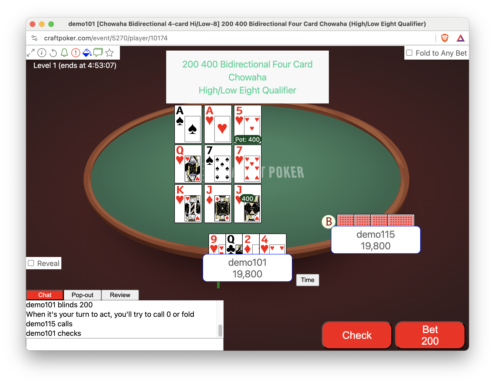
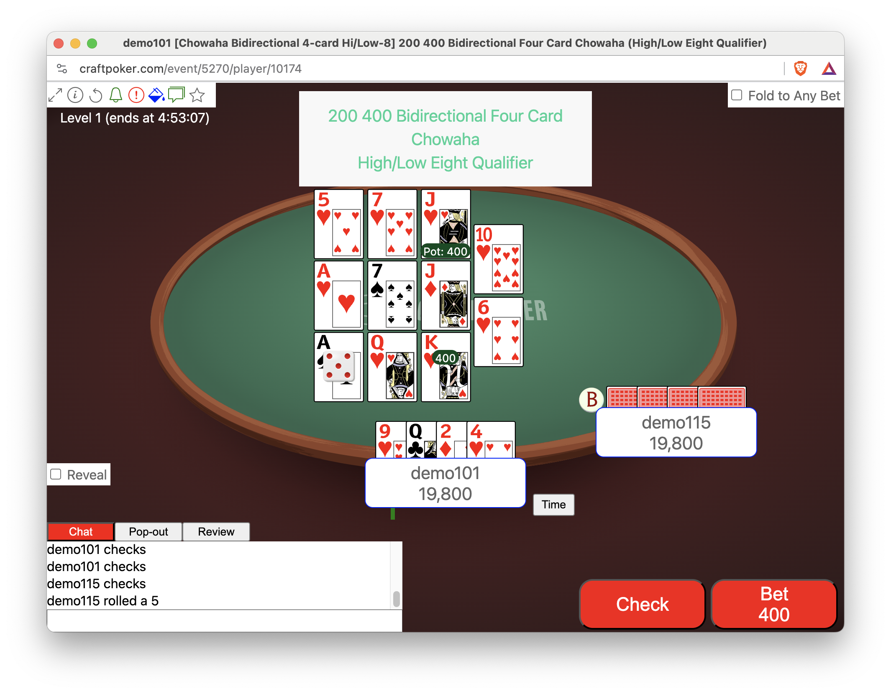

# Bidirectional Chowaha

Like
[Chowaha](https://secure.barge.org/bargerulebooks/BARGERuleBook2021-20210712.pdf#page=37),
but a roll of a die determines whether each of the three flops are
by row (like regular chowaha) or by column.

## Cards are Rotated to Fit On the Screen

Although the original email explaining Bidirectional Chowaha stated:

> after the flop betting, button rolls die to determine whether turn
> and river are dealt to the right of flops or underneath flops

there's not enough room to add the turn and river beneath the flops.
So, if a four, five or six is rolled, the cards are rotated
counter-clockwise, so that the turn and river will _have the same
effect_ as though they were dealt beneath.

Consider the following three flops. There are six hearts, but no row
has all three hearts.  The third column, however, is the five of
hearts, the seven of hearts and the jack of hearts.

When a five is rolled on the die, the third column becomes the top
row; middle column becomes the middle row and the first column becomes
the bottom row.

So now, the six of hearts can be used with either what formerly was the first
two columns and the ten of hearts can be used with what formerly was the
last two columns, and everything fits on the screen.

It's ugly, but squishing everything together was worse&mdash;**much worse**.
