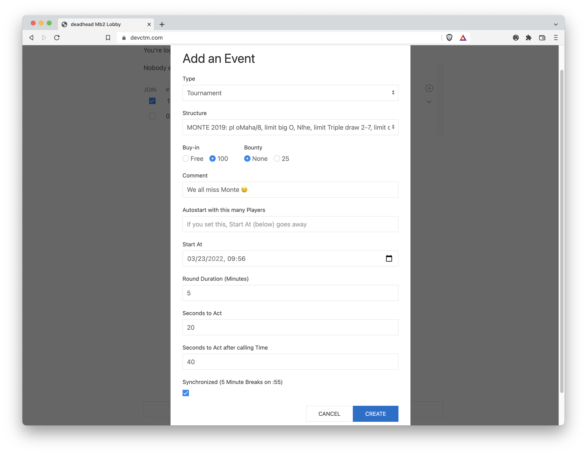

# Creating Tournaments

In the [lobby](../lobby.md), if you click on the white plus small icon, you get
a dialog that looks something like:

### Type

For now, just leave the Type as `Tournament`.

### Structure
The Structure attribute is a pull-down menu from one of more than a
hundred pre-existing tournament structures.  Currently you can not
create your own structure.

### Buy-in
Tournaments that are created for testing or demo purposes should be
Free, since free tournaments don't affect anyone's standings.
Tournaments where people are expected to play well should
have a 100 buy-in if for no other reason than to make it clear that
the participants will be taking the tournament seriously.

### Bounty
If the `25` radio button is selected, then sufficient Fun Money is
deducted from the prize pool so that an award of FM 25 can be made to
the player who busts another player.  If N people are in a tournament,
then N-1 bounties will be paid out by the time the tournament ends.

### Comment
Adding a comment is optional.  If you add a comment, it will show up
when people hover over the tournament structure in the listing of
upcoming tournaments.

### Autostart

If you put a number in the `Autostart` field, then the tournament will
start automatically once that number of participants join. In general,
you should not create an autostart tournament unless you think there
are enough people in the lobby to sign up within five or ten minutes,
otherwise you may find that nobody will sign up because it will be too
hard to predict when it will start.

If you put a number in `Autostart`, the `Start At` field will be removed.
You can only either start by `Autostart` or `Start At`, not both.

### Start At

Start At is in the same timezone as upcoming tournaments are displayed in.
That's whatever your browser thinks your timezone is.  The first time
you bring up the "Add a Tournament" dialog, "Start At" is pre-populated
with a value that is ten minutes into the future.  However, after that,
the dialog simply remembers whatever value was in that field previously.

### Round Duration

Round Duration (Minutes) is in essence a scaling factor.  In most
tournaments, all rounds are the same length.  When create a new tournament
and specify the round duration, what you're _really_ doing is saying how
long you want the first round to be.  If any rounds have a different duration
from the duration of the first round, they'll be scaled.

So, if there's a structure where the odd numbered rounds are 20 minutes
and the even numbered rounds are 30 minutes, if you specify Round
Duration as 5 minutes, then you'll have a tournament where the odd
numbered rounds are 5 minutes and the even ones are 7.5 minutes.

The TOC (Tournament of Champions) style format has a 15 minute Hold'em
first round, an 18 minute Stud second round and a 22 minute Omaha/8
third round.  So, if "Round Duration (Minutes)" is set to 5, then the
second round will be 6 minutes and the third round will be seven
minutes, twenty seconds long.

For a dozen or so players, five minute rounds for most structures results
in a tournament that finishes in about an hour and a half.

### Seconds to Act

Seconds to Act is how much time a player gets to act before being sent
to vacation.  No, 999 is not a reasonable number of "Seconds to Act".
Typically we use 45 there and that's the default when this dialog comes
up.

A player may call time to get more time to act.  There currently is no
limit on how many times a player can call time.  Calling time resets
the number of seconds to act (it does _not_ add to the number of
seconds to act).  So, if "Seconds to Act after calling Time" is set to
60, calling time will mean that the player must act within 60 seconds
regardless of how much time to act the player had remaining.

### Synchronized Breaks

Schedules have breaks built into them, and like Round Duration, they
scale based on the same ration of the "Round Duration (Minutes)"
setting to the duration of the first level in the structure.  That can
result in breaks that would be too short were it not for the "Minimum
Break Duration in Minutes" setting.  However, the duration of a break
is like the duration of a round in that it can start in the middle of
a hand. The players who are still in the hand still need to finish the
hand.
