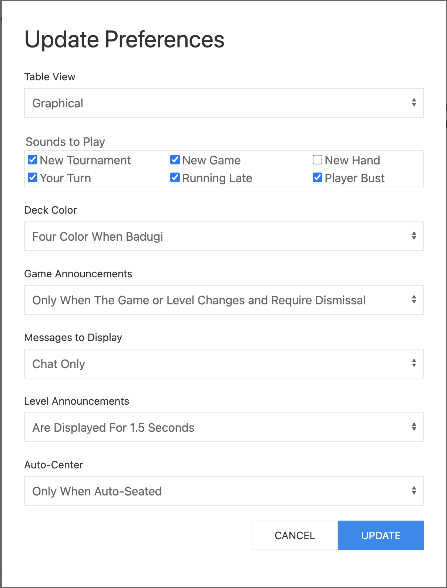

# Preferences

If you click on the [preferences icon](./top_line.html#preferences) in
the top line of the lobby, you'll get a modal dialog that looks
something like the following.

Almost all of these preferences control what will happen on subsequent
table windows created for you. The `New Tournament` check-box in the
`Sounds To Play` section is the exception. The New Tournament sound
comes from the lobby.

The slightly confusing options are: `Four Color When Badugi` `Deck
Color` option and the `Only When Auto-Seated` `Auto-Center` option.

### Four Color When Badugi

`Four Color When Badugi` is a setting "between" `Black and Red` and
`Four Color`.

`Black and Red` always uses **black** for clubs and spades
and red for diamonds and hearts.

`Four Color` always uses green for
clubs, blue for diamonds, red for hearts and **black** for spades.

`Four
Color When Badugi` uses `Black and Red` unless the game currently
being played uses Badugi ranking when figuring out how to award or
split the pot, in which case `Four Color` is used. So whether or not
to use a four color deck can change each time the game changes.

### Auto-Seated

When you play a tournament, you do not get to choose your seat, hence
you are auto-seated.

When Ring Game support is added, you'll have the option of choosing
your seat when a seat is available or having a seat assigned to you
when coming off a wait list.

So, for now, there's basically no difference between `Always` and
`Only When Auto-Seated`.

