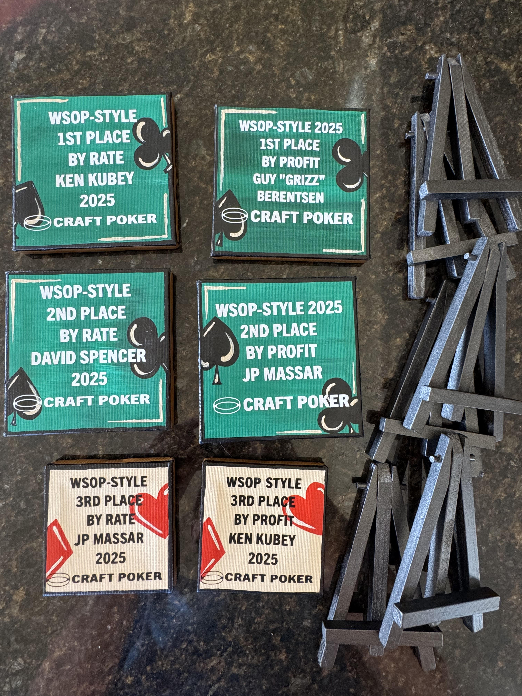

# WYWAE

## Overview

WYWAE stands for "Wish You Were At
[EMBARGO](https://www.barge.org/embargo/2026/schedule/)".  

WYWAE is a series of ten
mb2 tournaments leading up to, and running concurrently with, EMBARGO.

In 2025, there are six prizes, all physical awards; no cash.
The awards are being painted by the same artist and in the same
style as the WSOP-Style 2025 awards were.

I (Cliff Matthews, aka
[deadhead](https://ctm.github.io/docs/yld/life/too-public.html)) 
will play in the series but will be ineligible for awards.

The awards are for the top three players on the leaderboard by
profit and also by win rate at the end of the series. 

To qualify for an overall win by rate prize, the player has to
complete at least five tournaments.  NOTE: that is five different
tournaments, so if you play in a tournament and re-enter, only the
initial entry counts as one of your at-least-five tournaments. The
player does not have to complete five different structures. The SECOR
tournament on January 27th is a different tournament from the SECOR
tournament on January 31st, even though they're the same structure.

From the craftpoker.com lobby, the `#` column in the `WYWAE 2026
Leaderboard` report is the total number of entries per player, **not**
the number of distinct tournaments. So, simply having a value of five
or more in that column does not mean you've played five or more
distinct tournaments.

## It's a freeroll

There has never been (and never will be) an entry fee.

## The Tournaments

The first nine tournaments are held in the last nine days of January,
one per day. The tenth (i.e., the final) tournament is held on the
first of February.

All tournaments will be held at "the standard craftpoker.com daily
tournament time", which is 5:05 Pacific (which is also 6:05 Mountain,
7:05 Central and 8:05 Eastern).

In the mb2 lobby, the times will be in the time zone your
browser is configured for (which&mdash;for most people&mdash;is your
local time zone).

Tournaments are currently available for registration at
[craftpoker.com](https://craftpoker.com), and mimic the [official
EMBARGO structures](https://omaholic.com/2026_EMBARGO_Structures.pdf).

This series is not sanctioned, endorsed or in any other way sponsored
or related to the BARGE organization.  It is being put on by Craft
Poker Co., a completely unrelated corporation.

|Day|Date|Event|Winner|
|---|---:|-----|------|
|Friday|23rd|<a href="https://craftpoker.com/tournament/structure/6266" target="_blank">HAM & Pineapple</a>|[ODB Phat Mack🏆](https://craftpoker.com/event/6266/player/17)|
|Saturday|24th|<a href="https://craftpoker.com/tournament/structure/6267" target="_blank">World Online Chowaha Championship (4 Card Chowaha)</a>|[jpmassar](https://craftpoker.com/event/6267/player/14)|
|Sunday|25th|<a href="https://craftpoker.com/tournament/structure/6268" target="_blank">Dealer's Die</a>|[FerencL](https://craftpoker.com/event/6268/player/10761)|
|Monday|26th|<a href="https://craftpoker.com/tournament/structure/6269" target="_blank">NLHE</a>|[deadhead](https://craftpoker.com/event/6269/player/10)|
|Tuesday|27th|<a href="https://craftpoker.com/tournament/structure/6270" target="_blank">SECOR</a>|[FerencL](https://craftpoker.com/event/6270/player/10761)|
|Wednesday|28th|<a href="https://craftpoker.com/tournament/structure/6271" target="_blank">Drawmaha Mix</a>|[Grizz](https://craftpoker.com/event/6271/player/9)|
|Thursday|29th|<a href="https://craftpoker.com/tournament/structure/6272" target="_blank">HAM & Pineapple</a>||
|Friday|30th|<a href="https://craftpoker.com/tournament/structure/6273" target="_blank">Dealer's Die</a>||
|Saturday|31st|<a href="https://craftpoker.com/tournament/structure/6274" target="_blank">SECOR</a>||
|Sunday|1st|<a href="https://craftpoker.com/tournament/structure/6275" target="_blank">Drawmaha Mix</a>||

## A few Differences from EMBARGO

Since this is an online event, we've made a few changes.

### Starts before EMBARGO

EMBARGO starts on January 29th, but WYWAE starts on the 23rd, so people
attending EMBARGO have a chance to participate in WYWAE and can play
EMBARGO's esoteric games online before playing in real life.

### One Tournament a Day

Some of the people who would attend EMBARGO but don't, because they
work or otherwise have daytime commitments, aren't going to play
online poker in the middle of the day.  Additionally, regular
craftpoker.com denizens are used to the 5:05 Pacific start time, so
we're keeping the start time for WYWAE.

### Four of the structures are repeated

All six WYWAE variants of the EMBARGO tournaments are being dealt
before EMBARGO starts.  EMBARGO itself is four days long, so we're
repeating the four least common structures so that people who can't
make EMBARGO can play vicariously.

### Dealer's Die instead of Mix Max Binglaha

Mb2 doesn't yet know how to change the number of seats per table in a
tournament, so instead of Mix Max Binglaha, we'll have "[Dealer's
Die](https://craftpoker.com/tournament/template/dealers_die)", which
will have 6-seated tables, and will be a Dealer's Choice game, but the
only choices will be poker games that involve a die roll, which
include the various games we've played in the past, as well as
[Crayfish](https://www.barge.org/rulebook/crayfish.html) Omaha and
Crayfish Hold'em.

### FM 100 Buy-in

Each event has an FM 100 buy-in. Mb2 accounts are allowed to go
negative, so you do not need Fun Money to enter or re-enter.

### Round Duration

All rounds are five minutes long.  Mb2 has the ability to have
different length rounds, so it could emulate the different round
durations of [EMBARGO's HAM &
Pineapple](https://omaholic.com/2026_EMBARGO_Structures.pdf#page=1)
structure, but online, that would just add confusion.

### Breaks at 55 past the hour

The WYWAE breaks will begin after each table has finished a hand at or
after 55 minutes after the hour. The break will then be five minutes
long.

### Late Registration

In the WYWAE tournaments, late registration will be allowed through level 9.

### Re-entries

During WYWAE tournaments, you may re-enter up to two times, through level 9.

### Table sizes

The number of seats at a table will not change during any WYWAE
tournaments, e.g., HAM & Pineapple will be six seated the entire time;
it will _not_ have a seven seated final table.  This limitation is
because Mb2 does not currently support changing the number of seats
during an event.

### No Player Scrambling

Player scrambling in real life is, if I understand correctly, designed
to encourage people to talk to each other more; people tend to talk to
the players adjacent to them. Player chat works differently online, so
Mb2 doesn't support player scrambling.

### Antes Post before Blinds

Currently, mb2 posts antes before blinds, which means that if a player
is all-in for the ante, that player can only with the ante back.  That
was the common way to do big blind antes initially, which is why mb2
implemented it that way.  Most tournaments now post the blind before
the ante, so an all-in player can win more.  Mb2 will probably [change
this](https://github.com/ctm/mb2-doc/issues/1491) before the start of
the World Series of Poker.
