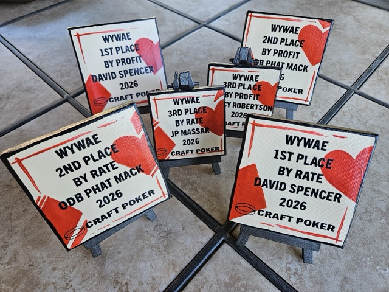

# WYWAE

The WYWAE series for 2026 finished on February 1st.

## Congratulations FerencL, ODB Phat Mack🏆, NNR13 and jpmassar

#### By Profit

<table>
<thead>
<tr>
<th></th>
<th>Profit</th>
<th>Nick</th>
<th>#</th>
</tr>
</thead>
<tbody>
<tr>
<td>1st</td>
<td style="text-align: right;">822</td>
<td>FerencL</td>
<td>8</td>
</tr>
<tr>
<td>2nd</td>
<td style="text-align: right;">820</td>
<td>ODB Phat Mack🏆</td>
<td>9</td>
</tr>
<tr>
<td>3rd</td>
<td style="text-align: right;">80</td>
<td>NNR13</td>
<td>1</td>
</tr>
</tbody>
</table>

#### By Rate

<table>
<thead>
<tr>
<th></th>
<th>Rate</th>
<th>Nick</th>
<th>#</th>
</tr>
</thead>
<tbody>
<tr>
<td>1st</td>
<td style="text-align: right;">0.82</td>
<td>FerencL</td>
<td style="text-align: right;">8</td>
</tr>
<tr>
<td>2nd</td>
<td style="text-align: right;">0.75</td>
<td>ODB Phat Mack🏆</td>
<td style="text-align: right;">9</td>
</tr>
<tr>
<td>3rd</td>
<td style="text-align: right;">-0.07</td>
<td>jpmassar</td>
<td style="text-align: right;">10</td>
</tr>
</tbody>
</table>

## Six Prizes, No Cash, Lots of Fun

There were six prizes, all physical awards; no cash.
The awards were painted by the same artist and in the same
style as the WSOP-Style 2025 awards:

I (Cliff Matthews, aka
[deadhead](https://ctm.github.io/docs/yld/life/too-public.html)) 
played in the series but was ineligible for awards.

The awards were for the top three players on the leaderboard by
profit and also by win rate at the end of the series. 

To qualify for an overall win by rate prize, the player had to have
completed at least five tournaments.  NOTE: that was five different
tournaments, so if you played in a tournament and re-entered, only the
initial entry counted as one of your at-least-five tournaments. The
player did not have to complete five different structures. The SECOR
tournament on January 27th was a different tournament from the SECOR
tournament on January 31st, even though they were the same structure.

From the craftpoker.com lobby, the `#` column in the `WYWAE 2026
Leaderboard` report is the total number of entries per player, **not**
the number of distinct tournaments. So, simply having a value of five
or more in that column does not mean you've played five or more
distinct tournaments.

## Overview

WYWAE stands for "Wish You Were At
[EMBARGO](https://www.barge.org/embargo/2026/schedule/)".  

WYWAE was a series of ten
mb2 tournaments leading up to, and running concurrently with, EMBARGO.

## It's a freeroll

There has never been (and never will be) an entry fee.

## The Tournaments

The first nine tournaments were held in the last nine days of January,
one per day. The tenth (i.e., the final) tournament was held on the
first of February.

All tournaments were held at "the standard craftpoker.com daily
tournament time", which is 5:05 Pacific (which is also 6:05 Mountain,
7:05 Central and 8:05 Eastern).

The tournaments mimicked the [official
EMBARGO structures](https://omaholic.com/2026_EMBARGO_Structures.pdf).

This series was not sanctioned, endorsed or in any other way sponsored
or related to the BARGE organization.  It was put on by Craft
Poker Co., a completely unrelated corporation.

|Day|Date|Event|Winner|
|---|---:|-----|------|
|Friday|23rd|<a href="https://friends.craftpoker.com/tournament/structure/6266" target="_blank">HAM & Pineapple</a>|[ODB Phat Mack🏆](https://friends.craftpoker.com/event/6266/player/17)|
|Saturday|24th|<a href="https://friends.craftpoker.com/tournament/structure/6267" target="_blank">World Online Chowaha Championship (4 Card Chowaha)</a>|[jpmassar](https://friends.craftpoker.com/event/6267/player/14)|
|Sunday|25th|<a href="https://friends.craftpoker.com/tournament/structure/6268" target="_blank">Dealer's Die</a>|[FerencL](https://friends.craftpoker.com/event/6268/player/10761)|
|Monday|26th|<a href="https://friends.craftpoker.com/tournament/structure/6269" target="_blank">NLHE</a>|[deadhead](https://friends.craftpoker.com/event/6269/player/10)|
|Tuesday|27th|<a href="https://friends.craftpoker.com/tournament/structure/6270" target="_blank">SECOR</a>|[FerencL](https://friends.craftpoker.com/event/6270/player/10761)|
|Wednesday|28th|<a href="https://friends.craftpoker.com/tournament/structure/6271" target="_blank">Drawmaha Mix</a>|[Grizz](https://friends.craftpoker.com/event/6271/player/9)|
|Thursday|29th|<a href="https://friends.craftpoker.com/tournament/structure/6272" target="_blank">HAM & Pineapple</a>|[jpmassar](https://friends.craftpoker.com/event/6272/player/14)|
|Friday|30th|<a href="https://friends.craftpoker.com/tournament/structure/6273" target="_blank">Dealer's Die</a>|[jpmassar](https://friends.craftpoker.com/event/6273/player/14)|
|Saturday|31st|<a href="https://friends.craftpoker.com/tournament/structure/6274" target="_blank">SECOR</a>|[ODB Phat Mack🏆](https://friends.craftpoker.com/event/6274/player/17)|
|Sunday|1st|<a href="https://friends.craftpoker.com/tournament/structure/6275" target="_blank">Drawmaha Mix</a>|[ODB Phat Mack🏆](https://friends.craftpoker.com/event/6275/player/17)|

## A few Differences from EMBARGO

Since this was an online event, we made a few changes.

### Started before EMBARGO

EMBARGO started on January 29th, but WYWAE started on the 23rd, so people
attending EMBARGO had a chance to participate in WYWAE and could play
EMBARGO's esoteric games online before playing in real life.

### One Tournament a Day

Some of the people who would attend EMBARGO but don't, because they
work or otherwise have daytime commitments, weren't going to play
online poker in the middle of the day.  Additionally, regular
craftpoker.com denizens are used to the 5:05 Pacific start time, so
we kept that start time for WYWAE.

### Four of the structures were repeated

All six WYWAE variants of the EMBARGO tournaments were dealt
before EMBARGO started.  EMBARGO itself was four days long, so we
repeated the four least common structures so that people who couldn't
make EMBARGO could play vicariously.

### Dealer's Die instead of Mix Max Binglaha

Mb2 doesn't yet know how to change the number of seats per table in a
tournament, so instead of Mix Max Binglaha, we had "[Dealer's
Die](https://friends.craftpoker.com/tournament/template/dealers_die)", which
had 6-seated tables, and was a Dealer's Choice game, but the
only choices were poker games that involve a die roll, which
include the various games we've played in the past, as well as
[Crayfish](https://www.barge.org/rulebook/crayfish.html) Omaha and
Crayfish Hold'em.

### FM 100 Buy-in

Each event had an FM 100 buy-in. Mb2 accounts are allowed to go
negative, so you did not need Fun Money to enter or re-enter.

### Round Duration

All rounds were five minutes long.  Mb2 has the ability to have
different length rounds, so it could have emulated the different round
durations of [EMBARGO's HAM &
Pineapple](https://omaholic.com/2026_EMBARGO_Structures.pdf#page=1)
structure, but online, that would just have added confusion.

### Breaks at 55 past the hour

The WYWAE breaks began after each table had finished a hand at or
after 55 minutes after the hour. The break was then five minutes
long.

### Late Registration

In the WYWAE tournaments, late registration was allowed through level 9.

### Re-entries

During WYWAE tournaments, players could re-enter up to two times, through level 9.

### Table sizes

The number of seats at a table did not change during any WYWAE
tournaments, e.g., HAM & Pineapple was six seated the entire time;
it did _not_ have a seven seated final table.  This limitation was
because Mb2 did not support changing the number of seats
during an event.

### No Player Scrambling

Player scrambling in real life is, if I understand correctly, designed
to encourage people to talk to each other more; people tend to talk to
the players adjacent to them. Player chat works differently online, so
Mb2 doesn't support player scrambling.

### Antes Posted before Blinds

During WYWAE, mb2 posted antes before blinds, which meant that if a
player was all-in for the ante, that player could only win the ante
back.  That was the common way to do big blind antes initially, which
is why mb2 implemented it that way.  Most tournaments now post the
blind before the ante, so an all-in player can win more.  Mb2 [changed
this](https://github.com/ctm/mb2-doc/issues/1491) before the start of
the World Series of Poker.
