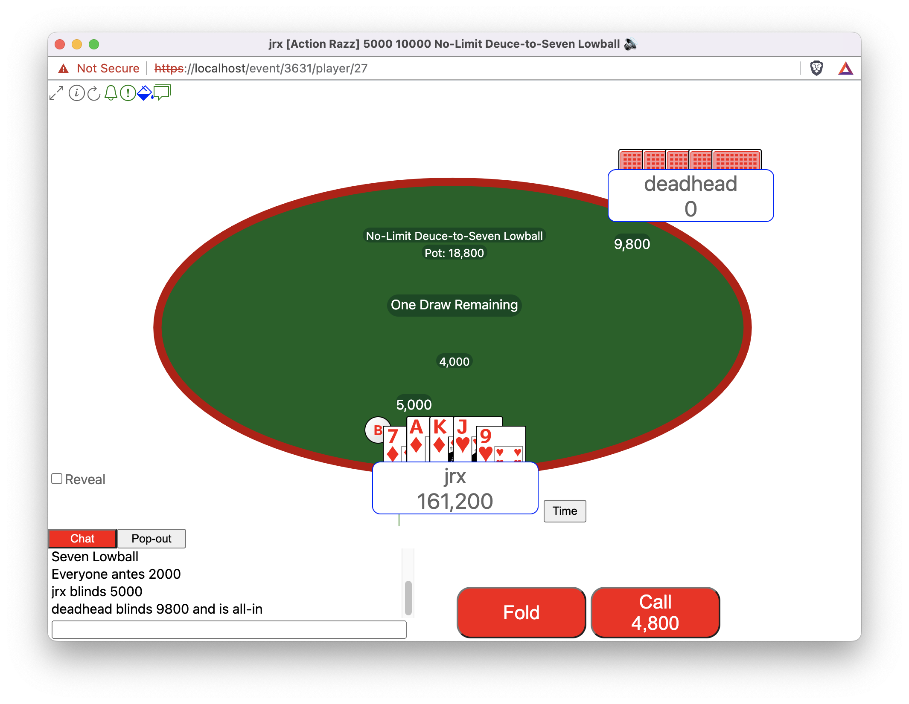

# Tables

Mb2 creates a new pop-up window for each table you are seated at or you
are observing. A table looks something like this[^1]:

Most of the elements in a table window should be self-explanatory.
Additionally, most also have a "tooltip" associated with them.  The
tooltip will be revealed if you leave your mouse over an element
that contains a tooltip.

The remaining pages of this Tables chapter document or clarify some of
the things that may not be self-explanatory.

[^1]: Currently, there are also two textual representations of a table,
but this manual ignores them because they are likely to go away after
the graphical interface becomes more attractive to the current text view
players.
