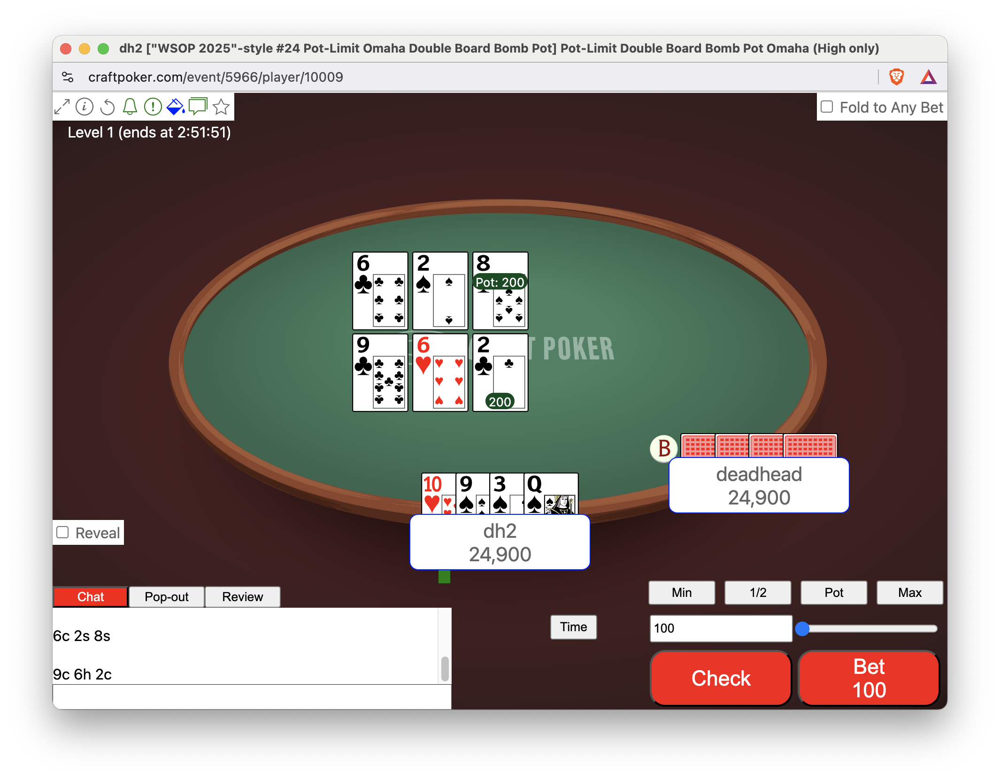
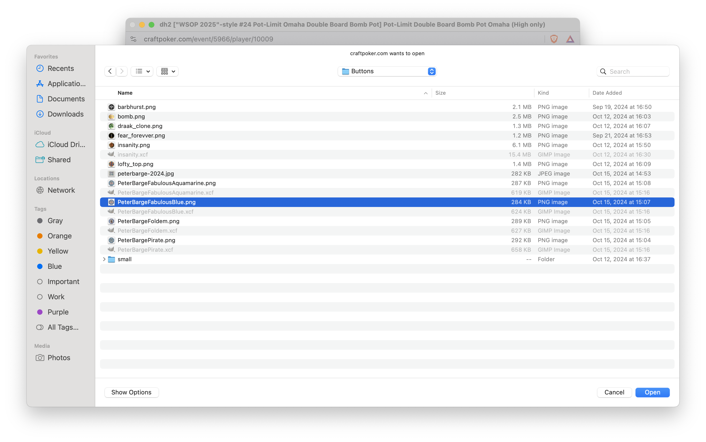
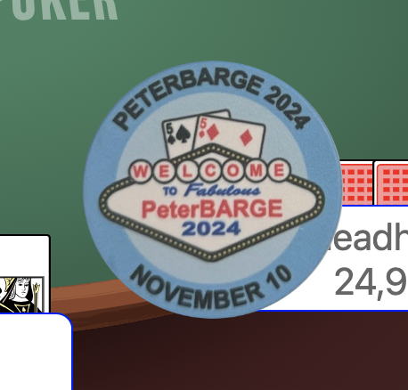
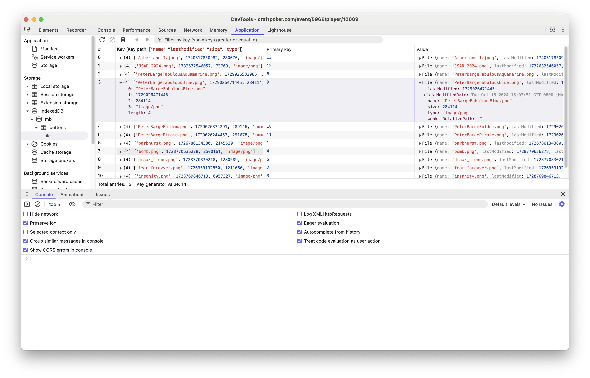

# Customizable Dealer Buttons

## How to use

By default, the dealer button at a table is an off-white circle with a
red letter B inside it.  It can be seen here to the upper-left of deadhead:

If you hover over the dealer button, it gets larger and if you click the
dealer button, you get an "[easter-egg](https://en.wikipedia.org/wiki/Easter_egg_(media))", a narcoleptic dinosaur:

!A close-up of the magnified narcoleptic dinosaur](./customizable-buttons/easter-egg-dino.png "The Hidden Other Button Face")

However, if you shift-click the button, you get a picker that allows you
to select an image to send directly to your client (i.e., the image is
never sent to the mb2 server):

After you send the image, that will be your button:

The two other built-in images are still available. You can cycle
through all your button images by repeatedly clicking on the button.

## Where its stored

Since the image was sent directly to your browser (e.g., Chrome), it
will not show up if you run a different browser (e.g., Safari).  However,
if you're adept with developer tools, you can see that your button has
been stored in your browser's IndexedDB:

## Why it matters

This is a proof-of-concept that demonstrates a way that mb2 can be
customized using assets that belong to the player and never travel
to the mb2 server.  Eventually, much more than the button will be
customizable and people will be able to make and share asset-packs
that allow their tables and the lobby to look how they like.

For the purpose of sharing with others, eventually it will be possible
to upload assets to an mb2 server, but that will be in _addition to_
private client-side only loading and will be completely optional.

## For the curious programmer

The loading and display of the custom buttons is done entirely using
Rust.  Mb2's source code is private, but a stand-alone client-side
loader that demonstrates how this is done is [available on
GitHub](https://github.com/ctm/upload).
