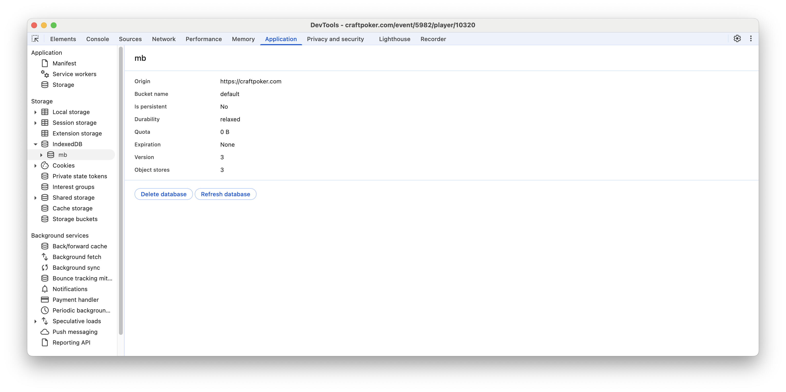
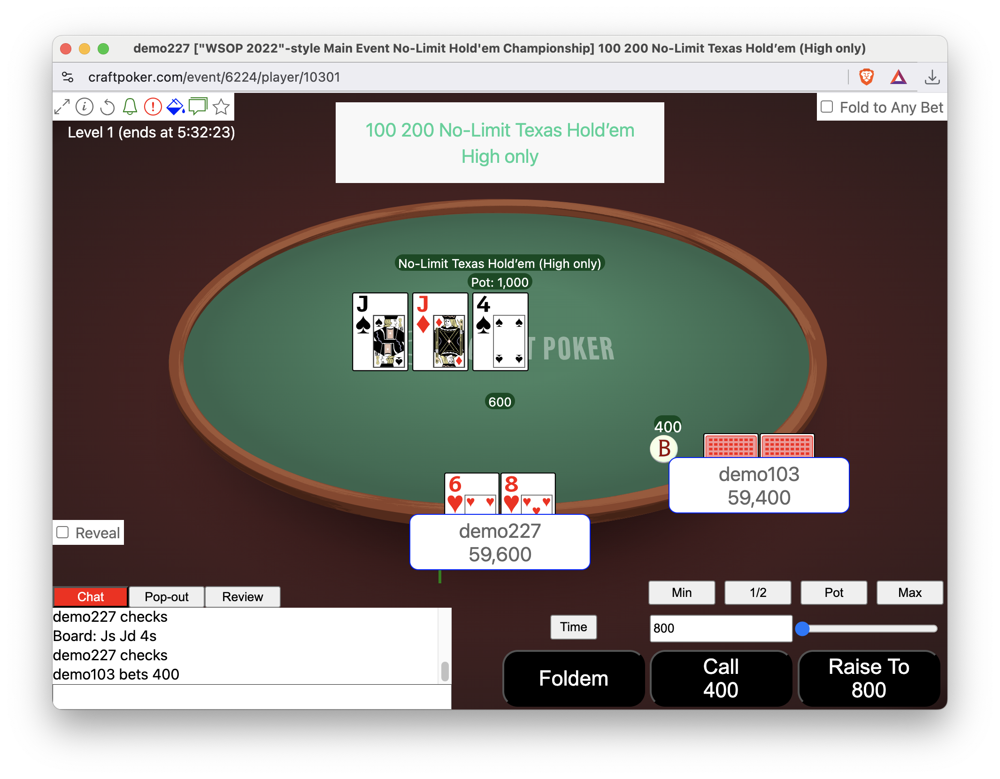

# Customizable Styles

Similar to [customizable backgrounds](customizable-backgrounds.md), if
you also hold the Alt-key (Option-key on Macintosh keyboards) down
when you shift-click on a background, you get a picker that allows you
to upload [CSS](https://developer.mozilla.org/en-US/docs/Web/CSS) or
[SASS](https://sass-lang.com/) that can change the appearance of a
table.

Before you do so, you should upload a custom button or background and
then use web developer tools to delete it, just to be sure you can do
so, because an unwanted style-sheet is going to be much more annoying
than an unwanted button or background.

To delete the database, you need to have a craftpoker.com window as
your front-most browser window (it can be the lobby or a table window)
then choose "View -> Developer -> Developer Tools" to get the
developer window up. Then you need to choose the Application tab, and
then select "IndexedDB -> mb2" in the pane on the left. That will
bring up a page that has a "Delete Database" button:



You can then choose "Delete database" and an empty database will be
rebuilt as soon as you refresh any craftpoker.om window. Once you're
comfortable deleting the database, you can bring up a table by using
the demo button on craftpoker.com (you'll only see the demo button if
you're not logged in, but you can be logged in to the lobby on one tab
and not logged in on another tab and get the demo button on that other
tab). You have to click the "demo" button, then create a demo
tournament, then click "Start" after that tournament has been
created. You should then get two table windows and you can play.

This is proof-of-concept, only. The format of a stylesheet is not
documented, nor is it stable. However, this is the style sheet used:
<a href="customizable-styles/table.scss" download>table.scss</a>. At
the end of that file there are two css rules currently commented out
by a multi-line comment:
```
/*
button.fold {
    text-indent: -9999px;
    line-height: 0;
}

button.fold::after {
    content: "Foldem";
    text-indent: 0;
    display: block;
    line-height: initial;
}
*/
```
If you delete the `/*` line and the `*/` line and then use Alt-shift-click to
install the resultant file, the "Fold" button will say "Foldem".  If you change
```
.pushable.std {
    background: #FB0F0C;
}
```
to
```
.pushable.std {
    background: black;
}
```
you'll get black buttons, etc.

E.g., after doing both:


## TLDR

Eventually, mb2 will be trivially customizable by anyone. Right now, nobody
is using this functionality, because doing so is just too painful even if
you are already comfortable with CSS and SASS.  However, the underlying
mechanism to support customization is present and sound.
